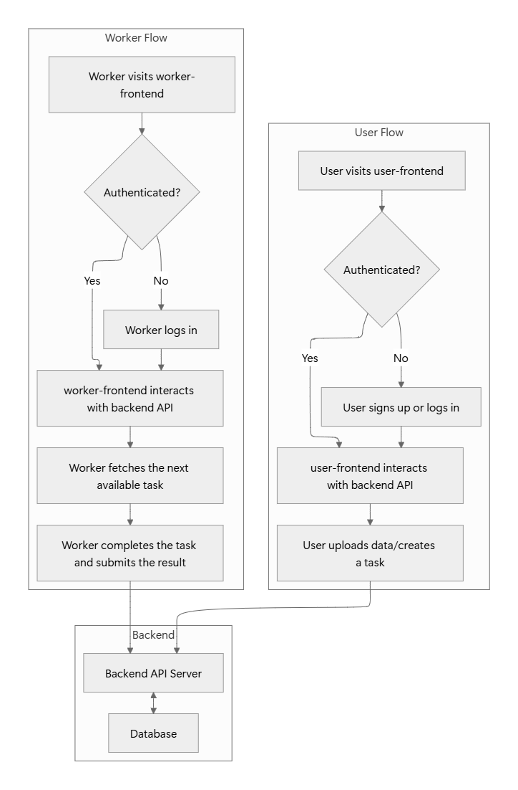
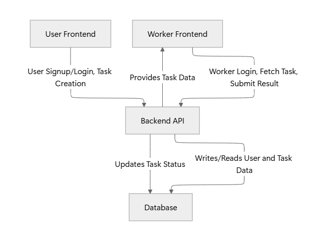
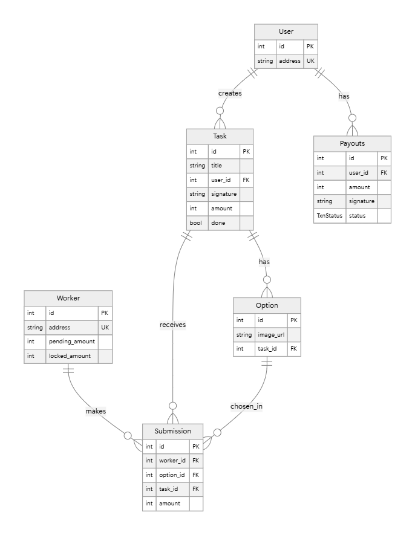

# Architecture

This document outlines the architecture of the DataSol project, including things to add, workflow diagrams, API documentation, and data flow diagrams.


## Workflow Diagram


## Data Diagram




## API Documentation

### User Routes (`/api/users`)

#### `POST /api/users/signup`
- **Description:** Registers a new user.
- **Request Body:**
  ```json
  {
    "email": "user@example.com",
    "password": "password123"
  }
  ```
- **Response:**
  ```json
  {
    "token": "jwt_token"
  }
  ```

#### `POST /api/users/login`
- **Description:** Authenticates a user.
- **Request Body:**
  ```json
  {
    "email": "user@example.com",
    "password": "password123"
  }
  ```
- **Response:**
  ```json
  {
    "token": "jwt_token"
  }
  ```

### Worker Routes (`/api/worker`)

#### `POST /api/worker/login`
- **Description:** Authenticates a worker.
- **Request Body:**
  ```json
  {
    "email": "worker@example.com",
    "password": "password123"
  }
  ```
- **Response:**
  ```json
  {
    "token": "jwt_token"
  }
  ```

#### `GET /api/worker/next-task`
- **Description:** Fetches the next available task for a worker.
- **Response:**
  ```json
  {
    "taskId": "task_id_123",
    "title": "Process uploaded data",
    "data": { ... }
  }
  ```

#### `POST /api/worker/task/submit`
- **Description:** Submits the result of a completed task.
- **Request Body:**
  ```json
  {
    "taskId": "task_id_123",
    "result": { ... }
  }
  ```
- **Response:**
  ```json
  {
    "message": "Task submitted successfully"
  }
  ```

## Database Diagram

This diagram represents the database schema based on `prisma/schema.prisma`.

